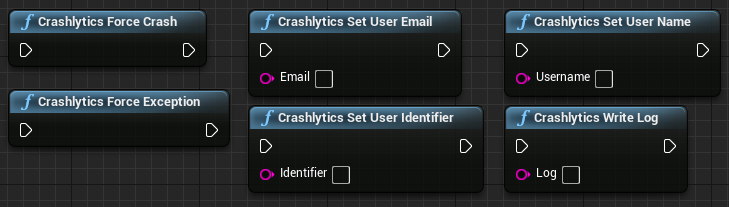
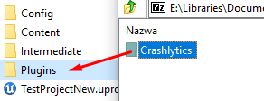
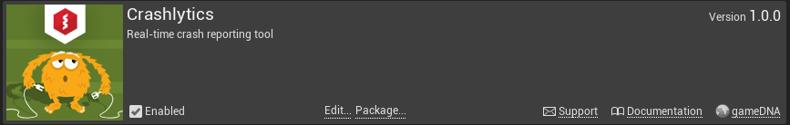

# Crashlytics

**Crashlytics** integrates out-of-the-box automatic crash reporting solution for **iOS & Android** into an Unreal Engine 4 project. Thanks to it you can spend less time on finding and more time on fixing crashes. Crashlytics provides deep and actionable insights, a real-time crash reporting solution, information about the number of crashes and affected users, the exact line of code game crashed on, and notifications about crashes via e-mail. Plugin includes all needed tools like symbols uploader and application configurator.

* **Current version:** 1.5.0
* **Binaries compiled for:** Unreal Engine 4.18
* **Required Unreal Engine 4.18 or above.**

## Features
* Real-time crash reporting tool
* Information about the number of crashes and affected users
* Provides the exact line of code your app crashed on
* Notifications about crashes via e-mail
* Works with dev & shipping builds
* Out-of-the-box for iOS & Android
* Additional SDK included
* Works with Blueprint-only & source code projects
* Works with Launcher & GitHub UE4 versions

## Blueprint nodes


## Setup
1. Copy this folder to the *Plugins* folder located in the main path of your project.

    

2. Enable *Crashlytics* in *Edit -> Plugins -> Misc -> Crashlytics*.

    

3. Go to _Edit -> Project Settings -> Crashlytics_ and set your _Crashlytics API Key_. You can obtain it on [fabric.io](http://www.fabric.io)
    
4. Turn on _Generate dSYM bundle for third party crash tools_ in _Project Settings_.

5. Go to _[PROJECT_FOLDER]/Build/Android/_

  a) If you already have created _custom_rules.xml_ file, simply add:
  ```xml
  <import file="crashlytics_build.xml" />
  ```
  b) If you don't have created _custom_rules.xml_ file yet, copy it from [[PLUGIN_FOLDER]/Extras/Android/custom_rules.xml](Extras/Android/custom_rules.xml).

## Uploading symbols
You need to upload symbols in order to properly handling crashes. You should do this after every submission to App Store or Google Play.

### iOS
1. Find your Xcode project:

    a. If you are directly packaging on Mac, go to _/[PATH_TO_PROJECT_ON_MAC]/Intermediate/ProjectFilesIOS/_

    b. If you are packaging with remote connection from Windows to Mac, go to _/Users/[USER_NAME]/UE4/Builds/[COMPUTER_NAME]/[PATH_TO_PROJECT_ON_WINDOWS]/Binaries/IOS/_

2. Copy content from _[PLUGIN_FOLDER]/Extras/iOS_ to path from previous point. Now you should have _Crashlytics_ and _Fabric_ folders in folder from previous point.

3. Run _[PROJECT_NAME].xcodeproj_ or _UE4_FromPC.xcodeproj_

4. In the _Project Navigator_, click on your project and add a new run script build phase

5. Add following code to new run script build phase with replacing _[API_KEY]_ and _[BUILD_SECRET]_

        ./Fabric/run [API_KEY] [BUILD_SECRET]

6. Build your project by clicking on _Product -> Build_

7. Go to Fabric dashboard -> Settings -> Apps -> Your game -> Missing DSYMs. Here upload new DSYMs from [PROJECT_FOLDER]/Binaries/IOS.

### Android

1. Add new _ant_ system variable.

2. Go to _[PATH_TO_PROJECT]/Intermediate/Android/APK/_

3. Open _Command Prompt (Terminal)_ and run following command:

        ant crashlytics-symbols

Plugin icon designed by _Freepik_.
